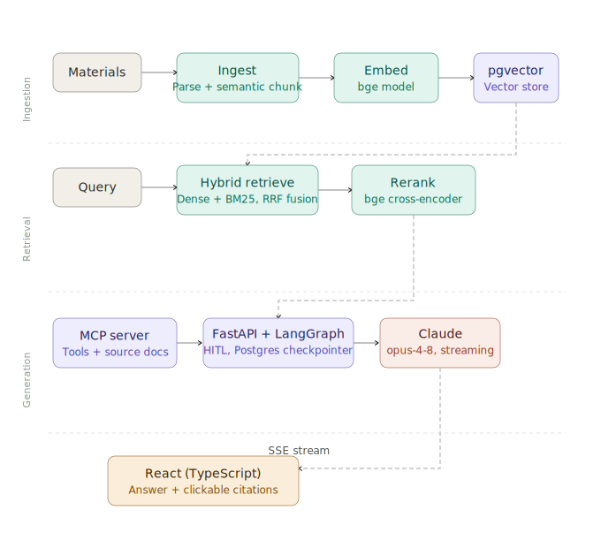

# Study Assistant - Architecture & Structure

A personal study assistant over course materials (lecture slides, papers, notes). Answers questions
with synthesis from Claude, grounded in retrieved sources, with citations back to the exact source
slide/page. The locked decisions that shaped all of this are recorded as Architectural Decision
Records (ADRs) in [`decisions/`](decisions/).

## Outline

- [Goals](#goals)
- [Architecture](#architecture)
- [Governance and Conventions](#governance-and-conventions)
- [Directory](#directory)
- [Future Scope](#future-scope)

## Goals

This is a local, single-user project, and that scope is deliberate. The primary goal is to unwind
the Retrieval-Augmented Generation (RAG) stack end-to-end, which drives the decision to run
everything on machine, offline, and for free. Embeddings and the cross-encoder run in-process, so
there are no per-call API costs and no network dependency for retrieval and because nothing transits
to a vendor, the corpus stays private.

> NOTE  
> "Offline and for free" scopes to ingestion and retrieval, which run entirely on-machine.
> Generation is the one exception: it calls Claude (`claude-opus-4-8`) through the Anthropic API, a
> hosted, paid, online dependency. The model-agnostic goal therefore applies _below_ the reasoning
> layer — the embedder, reranker, and coding agent are swappable, while the reasoning model is
> deliberately Claude-coupled for synthesis quality. A path to closing that gap is in
> [Future Scope](#future-scope).

Domain-level goals that shaped the architecture also include keeping a human in the loop (HITL) to
steer an ambiguous question before a slow rerank runs over the wrong material, keeping the reasoning
model swappable rather than foundational, and keeping the reasoning layer ignorant of where chunks
live or how they're scored so retrieval stays a clean, replaceable concern.

## Architecture

The system is a retrieval-augmented pipeline organized into three lanes: Ingestion, Retrieval, and
Generation over a single PostgreSQL/pgvector store, with a React frontend on top.



### Ingestion

Ingestion is driven by the `study` CLI: it points at a folder of course materials, parses slides,
papers, and notes (pptx/pdf/md), semantically chunks them, embeds each chunk with `bge-m3`, and
upserts into pgvector. It is idempotent and re-runnable, so the corpus grows as courses progress
without reprocessing what's already stored.

### Retrieval

Retrieval is the heart of the system and lives entirely in `rag_core`. A query runs hybrid search —
dense vector similarity against pgvector plus BM25 lexical search — fused with RRF, then a
`bge-reranker-v2-m3` cross-encoder re-scores the top candidates into the final top-k. The reranker
is the single highest-leverage quality lever, reading query and document together to catch relevance
that bi-encoder embeddings miss. Retrieval quality is validated by an eval loop: a golden-set
harness (labeled query → expected document) introduced in the embeddings phase, which both guards
against regressions and demonstrates that reranking measurably improves results.

### Generation

Generation runs in the FastAPI backend, where a LangGraph state machine orchestrates the agent loop
— reaching retrieval through the MCP server's tools, pausing at HITL checkpoints, and synthesizing a
grounded answer with Claude (`claude-opus-4-8`, adaptive thinking, streaming). Responses stream to
the React frontend over SSE, with citations resolving back to the exact source slide or page.

## Governance and Conventions

The governance context model is a layered set of AGENTS.md files that encode the project's
architectural invariants as enforceable rules, because key properties (like decoupling) now rest on
discipline rather than physical service boundaries.

A root AGENTS.md holds the project one-liner and entry point, while each package and service carries
its own scoped AGENTS.md describing its surface and relationship to the rest, each paired with a
CLAUDE.md stub. This puts focused context exactly where work happens. For example, an agent editing
the MCP server is told it is a consumer of rag_core, never a reimplementer.

This governance principle ensures that intentions become constraints that can be asserted by another
coder or coding agent in the future.

> NOTE  
> The real content lives under the tool-neutral `AGENTS.md` name so any coding agent can read it;
> `CLAUDE.md` is a thin import stub (a single `@AGENTS.md` line) that aliases it for Claude Code.
> The `CLAUDE.md` stub is kept to play nice with Claude Code's tooling. Commands such as: `/init`
> and `/memory` reference `CLAUDE.md` by convention, and its directory-walk loading (which pulls in
> each scoped file exactly when an agent works in that directory) triggers on `CLAUDE.md`. Keeping
> the stub preserves all of that while the canonical content stays under `AGENTS.md`.

### Primary Conventions

- Retrieval lives only in `rag_core`. MCP server and API are consumers, never reimplementers.
- Lazy model loading: no `torch` import at module top-level outside `embed/` and `rerank/`.
- Embedder/reranker behind a small interface so the rest of the system is agnostic to the concrete
  model; the only real lock-in is the pgvector embedding dimension (`vector(N)`).

### Other Conventions

- Models: Claude via the Anthropic SDK, `claude-opus-4-8`, adaptive thinking, streaming.
- Python tooling: `uv` workspace; lint/format/typecheck in pre-commit and CI.
- The `study` CLI is its own top-level package (`cli/`), depending on `rag_core` as a workspace
  dependency. Keeps the ingestion entry point cleanly separated from the library.
- Model weights are cached in a named Docker volume, not baked into images — the multi-GB `bge`
  download happens once.

## Directory

```text
study_assistant/
├── AGENTS.md                    # canonical agent context — entry point, project one-liner
├── CLAUDE.md                    # import stub (@AGENTS.md) — Claude Code alias
├── CONTRIBUTING.md
├── README.md
├── .env.example
├── pyproject.toml               # uv workspace root
├── uv.lock
├── docker-compose.yaml
├── .pre-commit-config.yaml
├── .github/workflows/ci.yaml
├── docs/
│   ├── architecture.md          # this document
│   └── decisions/               # ADRs (0001-rag-retrieval-boundary.md, …)
├── packages/
│   └── rag_core/                # Shared library — all retrieval logic
│       ├── AGENTS.md            # canonical context — chunking, lazy-load, pgvector, rerank
│       ├── CLAUDE.md            # import stub (@AGENTS.md)
│       ├── pyproject.toml
│       ├── src/rag_core/
│       │   ├── ingest/          # pptx/pdf/md parsing, semantic chunking
│       │   ├── embed/           # bge embedder (lazy torch load)
│       │   ├── rerank/          # bge cross-encoder reranker
│       │   ├── retrieve/        # dense + BM25 + RRF fusion
│       │   ├── store/           # pgvector access, schema, migrations
│       │   └── config.py
│       └── tests/
├── cli/                         # `study` ingestion CLI — depends on rag_core
│   ├── AGENTS.md                # canonical context — CLI surface, calls into `rag_core`
│   ├── CLAUDE.md                # import stub (@AGENTS.md)
│   ├── pyproject.toml
│   ├── src/study_cli/
│   │   └── main.py              # `study` console-script entry point
│   └── tests/
├── services/
│   ├── mcp_server/              # wraps rag_core as MCP tools + source docs
│   │   ├── AGENTS.md            # canonical context — MCP tool surface, citations
│   │   ├── CLAUDE.md            # import stub (@AGENTS.md)
│   │   ├── pyproject.toml
│   │   ├── Dockerfile
│   │   └── src/ + tests/
│   └── api/                     # FastAPI + LangGraph + SSE streaming
│       ├── AGENTS.md            # canonical context — LangGraph, HITL, SSE
│       ├── CLAUDE.md            # import stub (@AGENTS.md)
│       ├── pyproject.toml
│       ├── Dockerfile
│       └── src/api/
│           ├── graph/           # LangGraph nodes, state, HITL checkpoints
│           ├── routes/          # /chat (SSE), /health, /resume
│           ├── mcp_client/      # connects to mcp_server
│           └── main.py
│       └── tests/
├── apps/
│   └── web/                     # React + TypeScript
│       ├── AGENTS.md            # canonical context — citations, SSE client, TS/React
│       ├── CLAUDE.md            # import stub (@AGENTS.md)
│       ├── package.json
│       ├── Dockerfile
│       └── src/
│           ├── components/      # chat, citation rendering, HITL approval
│           └── api/             # SSE client
└── infra/
    └── postgres/                # pgvector init.sql, model-weights volume notes
```

> NOTE  
> The Python packages are documented on a Sphinx + MyST + Furo site (`docs/conf.py`, deployed by
> `.github/workflows/docs-deploy.yaml`; see [ADR 0005](decisions/0005-documentation-tooling.md)).

## Future Scope

### Model Agnostic

A hybrid local/Claude generation approach would extend the model-agnostic goal through the reasoning
layer and make a fully free, offline run possible end-to-end. The generation node would sit behind a
small interface — the same pattern already used for the embedder and reranker — so config selects
the model per run: a local model served through an OpenAI-compatible runtime (Ollama, llama.cpp, or
vLLM) as the free default, with Claude reserved for harder questions where synthesis quality matters
most.

### Cloud Deployable

A cloud-deployable path is the natural next step beyond local: it would add managed Postgres, a
registry push, and prod-vs-local config. The heavier lift there is the local `bge` models, which are
expensive to host in the cloud — so a future cloud move may also revisit the embedding/reranking
stack (e.g. a hosted pairing like Voyage's `voyage-3` + `rerank-2.5`), a change gated by the
pgvector `vector(N)` dimension lock-in and therefore a re-embed plus schema migration.

### Multi User Auth

To avoid a future rewrite, the schema carries a `user_id` seam — a `user_id` column on the relevant
tables, defaulted for the single local user — so authentication and per-user isolation can be
layered on later by populating the seam and adding an auth layer, rather than reshaping the data
model.
